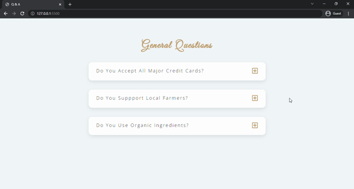

# QUESTIONS & ANSWERS
This project includes questions and answers. When you click the plus button near the question, you can see the answer to this question.  After seeing an answer, if you click the minus button near the question, the answer closes. If you click the other question, the answer to the previous question closes.



## Used Technologies
* 

* 

* 

## Installation
First clone the project.
```
git clone https://github.com/saglamburcu/questions-project.git
```

## Usage
```
cd questions-project
code .
```